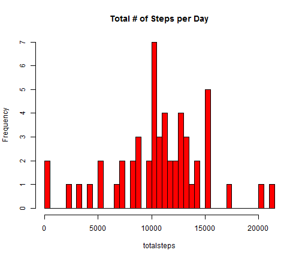
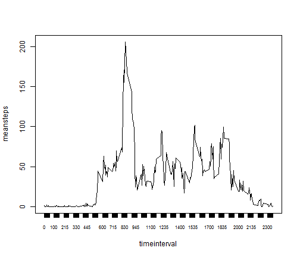

## Reproducible Research Peer Assessment 1 Submission
 
========================================================

This is a document describing operations carried out on the "Activity monitoring data"
dataset as part of a Peer Assessment assignment for the Reproducible Research course on Coursera.
The details for the data set are described in the documents associated with this respository.

The code below describes the operations involved in obtaining the raw data and preparing the environment for processing the data.


```r
## You should find what is your Working directory?.. Use getwd()
## to change your Working directory. setwd("Path to your working directory")
setwd("C:/R_Coursera/reproducableResearch/week2")
# create a dir for this task
if (!file.exists("./data")) 
        {dir.create("./data")}
## get the raw data, unzip it into the data directoty
fileurl <- "https://d396qusza40orc.cloudfront.net/repdata%2Fdata%2Factivity.zip"
download.file(fileurl,destfile="./data/repdata.zip")
```

```
## Error: unsupported URL scheme
```

```r
unzip("./data/repdata.zip", exdir="./data")
```


This code reads the data and processes it prior to answering the questions for this assignment.
For this initial work missing values (NA's) have been excluded.


```r
setwd("C:/R_Coursera/reproducableResearch/week2")
rep <- read.table("./data/activity.csv", header = TRUE, sep = ",")
## identify and exclude the NA's
badData<-complete.cases(rep)
scrubbedData<-rep[badData,][,] 
## Group the records by date and get the total number of steps for that day.
totalstepsperday <-aggregate(scrubbedData$steps, by=list(scrubbedData$date), FUN=sum)
colnames(totalstepsperday) = c("date", "totalsteps")
totalstepsperday[,1] = as.Date (totalstepsperday[,1])
```

## Report the mean total number of steps taken per day.

1) The following plot is a histogram of the total number of steps taken each day, as 


```r
setwd("C:/R_Coursera/reproducableResearch/week2")
attach(totalstepsperday)
hist(
        totalsteps, 	main = "Total # of Steps per Day",	breaks=nrow(totalstepsperday)	,	col="red"
	)
```

 

```r
meantotalsteps = mean(totalstepsperday[,2])
meantotalsteps = as.integer(meantotalsteps)
mediantotalsteps = median(totalstepsperday[,2])
```

2) 

The Mean number of steps per day are 10766    


The Median number of steps per day are 10765


```r
setwd("C:/R_Coursera/reproducableResearch/week2")
dailyactivitymean<- aggregate(scrubbedData$steps, by=list(scrubbedData$interval), FUN=mean)
colnames(dailyactivitymean) = c("timeinterval", "meansteps")
dailyactivitymean[dailyactivitymean[,2]  == max(dailyactivitymean$meansteps) ,]
```

```
##     timeinterval meansteps
## 104          835     206.2
```


## Average daily activity pattern


```r
setwd("C:/R_Coursera/reproducableResearch/week2")

attach(dailyactivitymean)

plot(meansteps ~         timeinterval ,  dailyactivitymean , xaxt = "n", type = "l")
axis(1,timeinterval,  cex.axis = .7 )
```

 

```r
maxininterval<-  dailyactivitymean[dailyactivitymean[,2]  == max(dailyactivitymean$meansteps) ,]

p<- maxininterval[1,1]
```
2) The  5-minute interval, on average across all the days in the dataset, contains the maximum number of steps is: 835


```r
noofNA<- sum(!complete.cases(rep))
```


## Imputing missing values


1.Calculate and report the total number of missing values in the dataset (i.e. the total number of rows with NAs)

The total number of missing values is: 2304


```r
# first round the mean step data per interval 
#roundedmeansteps[,1]<-  dailyactivitymean [,1]#
amendeddata<-data.frame(dailyactivitymean [,1], round(dailyactivitymean[,2])) 
# amendeddata has the rounded step value for each time interval, this will be used to populate the na values
```


2.Devise a strategy for filling in all of the missing values in the dataset. 

The strategy I have picked is to take the rounded mean 5 minute step interval.


3.Create a new dataset that is equal to the original dataset but with the missing data filled in


4.Make a histogram of the total number of steps taken each day and Calculate and report the mean and median total number of steps taken per day. Do these values differ from the estimates from the first part of the assignment? What is the impact of imputing missing data on the estimates of the total daily number of steps?


